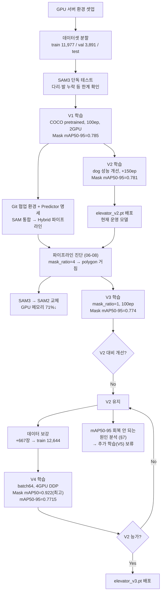

# Autolabel — 엘리베이터 CCTV Person/Dog Instance Segmentation

엘리베이터 CCTV 영상(person/dog)에 대한 SAM + YOLO 기반 오토라벨링 프로젝트의
**모델 학습/평가 파이프라인** 저장소입니다.

> 실제 운영 도구(백엔드/프론트엔드/추론 서버)는 별도 저장소
> `labeling-project` (`/nas03/1_EV_LABELING/git_repos/labeling-project.git`)에서 관리됩니다.
> 이 저장소는 그 운영 모델(`elevator_vX.pt`)을 만들어내는 **학습 파이프라인**입니다.

전체 작업 기록(환경 셋업, 트러블슈팅, 의사결정 과정)은
[`데이터셋 오토라벨링 프로젝트 — 기록.pdf`](./데이터셋%20오토라벨링%20프로젝트%20—%20기록.pdf) 참고.

---

## 전체 프로젝트 흐름



---

## 1. 환경 셋업

```bash
conda create -n autolabel python=3.10 -y
conda activate autolabel

# PyTorch (서버 CUDA 12.8 → cu121 빌드 사용)
pip install torch torchvision --index-url https://download.pytorch.org/whl/cu121

# 나머지 패키지
pip install -r requirements.txt
```

- Python 3.10, PyTorch 2.5.1+cu121, ultralytics 8.4.56
- GPU: NVIDIA RTX A6000 (48GB) — gpu-106
- `cu121`을 쓰는 이유: ultralytics가 기본 설치하는 최신 cu13x 빌드는 서버 드라이버(CUDA 12.8)와 호환 안 됨

---

## 2. 데이터셋

원본 데이터는 NAS에 있으며, 이 저장소에는 **포함되지 않습니다** (`.gitignore`).

```
/nas03/1_EV_LABELING/
├── corner/   (95개 영상 폴더, ~5,890장)
└── center/   (147개 영상 폴더, ~9,114장)
```

### 데이터셋 재생성

```bash
python scripts/split_dataset.py
```

- corner/center를 각각 7:2:1 (train/val/test)로 영상 단위 분할 후 합침 (data leakage 방지)
- `dataset/images/{train,val,test}`, `dataset/labels/{train,val,test}`에 NAS 원본을 가리키는 심볼릭 링크 생성
- `dataset/data.yaml` 자동 생성:

```yaml
path: /home1/Jwson08/autolabel/dataset
train: images/train
val: images/val
test: images/test
names:
  0: person
  1: dog
```

### 데이터 보강 (V4, 2026-06-12)

`incoming/`의 GT 11개 시퀀스(667쌍, NAS 보관)를 `dataset/images|labels/train`에 실제 파일로 병합.
재현 시 NAS의 incoming 원본 또는 최신 `dataset/labels/train` 캐시를 참고.

---

## 3. 모델 학습 (V1 → V4)

모든 학습은 **이전 버전의 `best.pt`에서 이어서** 진행 (continual fine-tuning).

| 버전 | 스크립트 | 시작 가중치 | 주요 변경 | 결과 (val, Mask) |
| --- | --- | --- | --- | --- |
| **V1** | `train.py` | `yolo11s-seg.pt` (COCO pretrained) | 100 epoch, batch 32, 2 GPU DDP | mAP50=0.921, mAP50-95=0.785 |
| **V2** | `train_v2.py` | V1 best.pt | 150 epoch (dog 성능 개선 목적) | mAP50=0.917, mAP50-95=0.781 — **현재 운영 모델** |
| **V3** | `train_v3.py` | V2 best.pt | `mask_ratio=4→1` (풀 해상도 마스크), batch 8 | mAP50=0.913, mAP50-95=0.774 — V2 대비 개선 없어 V2 유지 |
| **V4** | `train_v4.py` | V3 best.pt | 데이터 보강(+667장), batch 8→64, 2→4 GPU DDP | mAP50=0.922(최고), mAP50-95=0.7715 — V2 대비 mAP50-95 하락, V2 유지·추가학습 보류 |

### 실행 (Slurm)

```bash
sbatch scripts/slurm_train_v4.sh   # gpu-106, A6000 x4, DDP
```

- `--nodelist=gpu-106` 고정 필수 — gpu-107(Blackwell sm_120)은 현재 PyTorch(cu121)와 비호환
- 로그: `logs/train_v4_<jobid>.log`, 결과: `runs/segment/runs/segment/train_v4/`

### Slurm 없이 직접 실행 (V1 방식)

```bash
CUDA_VISIBLE_DEVICES=6,7 python scripts/train.py
```

---

## 4. 평가

```bash
python scripts/eval.py
```

- `runs/segment/runs/segment/train_vN/weights/best.pt`로 val set 전체 정량 평가 (mAP) + 샘플 20장 시각화
- 출력: `outputs/eval_metrics_vN.txt`, `outputs/eval_samples_vN/`
- 버전별로 `WEIGHTS`, `OUTPUT_DIR`, `METRICS_TXT` 경로를 수정해서 사용

추론 속도 측정:

```bash
python scripts/measure_inference_speed.py
```

파이프라인 진단 (YOLO/SAM/Hybrid 구간별):

```bash
python scripts/diagnose_yolo.py
python scripts/diagnose_sam.py
python scripts/diagnose_pipeline.py
python scripts/diagnose_metrics.py
```

---

## 5. 모델 버전 관리 & 배포

- 로컬 버전 스냅샷: `models/yolo11s_seg_v{N}_{YYYYMMDD}/` (best.pt, last.pt, README.md, args.yaml, results.csv/png, curves, predictions.json)
- 운영 배포 (NAS): `/nas03/models/labeling-project/elevator_vX.pt` + `elevator_vX.README.md`
  - `backend/config.py`의 `model_path` 기본값 또는 `/models/swap` API로 핫스왑
- SAM: `sam2_b.pt` (`/nas03/models/labeling-project/sam2_b.pt`) — SAM3 대비 메모리 71% 감소, polygon 품질 동등 (2026-06-09 교체)

---

## 6. 디렉토리 구조

```
autolabel/
├── scripts/            # 학습/평가/진단 스크립트, slurm 잡 파일
├── dataset/            # data.yaml (이미지/라벨은 NAS 심볼릭 링크, git 미포함)
├── models/             # 버전별 모델 메타데이터 (가중치 .pt는 NAS, git 미포함)
├── runs/, logs/, outputs/, incoming/, data/   # 학습/실험 산출물 (git 미포함)
└── requirements.txt
```

---

## 7. 모델/데이터 버전 변화 — 의사결정 흐름

각 버전의 정확한 설정·점수는 §3 표 참고. 여기서는 **왜 그 변경을 했는지**만 요약합니다.

- **V1 → V2**: V1 평가에서 dog 클래스의 mAP50-95(0.687)가 person(0.884) 대비 낮음을 확인 → V1 best.pt에서 +150 epoch 추가 학습 → `elevator_v2.pt`로 배포 (현재 운영 모델)
- **V2 → V3**: 파이프라인 진단(06-08)에서 `mask_ratio=4`로 인해 polygon 경계가 거칠다는 원인을 확인 → `mask_ratio=1`로 재학습. 결과는 V2 대비 소폭 하락 → **V2 유지** 결정
- **V3 → V4**: V3가 GPU 메모리를 거의 쓰지 않는 것을 확인(3.65GB/48GB) → batch 8→64, 2→4 GPU로 확대 + GT 667장 보강(train 12,644장)으로 재시도. 결과: Mask mAP50=0.922(전 버전 중 최고)이지만 Mask mAP50-95=0.7715로 V2(0.781) 대비 소폭 하락
- **최종 결론**: V2/V3/V4의 학습 곡선을 비교한 결과, mAP50-95(M)이 매 버전 학습 초반(20~54epoch)에 정점을 찍고 이후 100epoch까지 진행하며 오히려 하락하는 동일한 패턴 확인 → 매 버전 `lr0=0.01`로 optimizer/LR을 재시작하는 continual fine-tuning 구조가 원인으로 추정 (상세 분석은 작업 기록 §27.4 참고). **V2(`elevator_v2.pt`) 운영 유지, V4는 배포하지 않으며 추가 학습(V5)은 보류**

> 전체 상세 기록(환경 셋업, SAM3→SAM2 교체, 트러블슈팅 14건 등)은 [`데이터셋 오토라벨링 프로젝트 — 기록.pdf`](./데이터셋%20오토라벨링%20프로젝트%20—%20기록.pdf) 참고.
